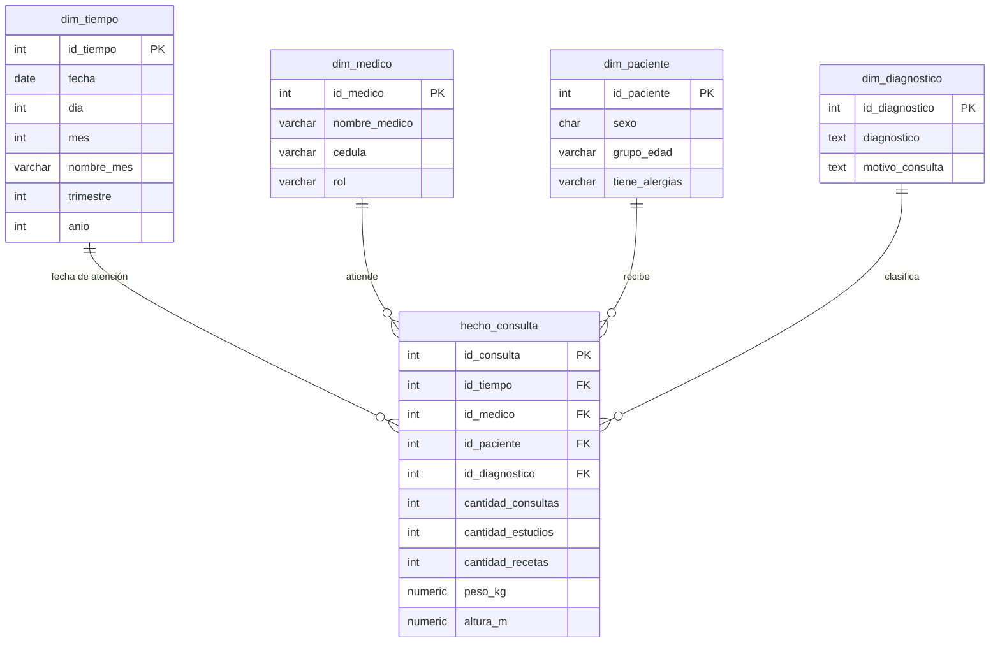

# Esquema Estrella · Consultorio Médico

```mermaid
erDiagram
    hecho_consulta {
        int id_consulta PK
        int id_tiempo FK
        int id_medico FK
        int id_paciente FK
        int id_diagnostico FK
        int cantidad_consultas
        int cantidad_estudios
        int cantidad_recetas
        numeric peso_kg
        numeric altura_m
    }

    dim_tiempo {
        int id_tiempo PK
        date fecha
        int dia
        int mes
        varchar nombre_mes
        int trimestre
        int anio
    }

    dim_medico {
        int id_medico PK
        varchar nombre_medico
        varchar cedula
        varchar rol
    }

    dim_paciente {
        int id_paciente PK
        char sexo
        varchar grupo_edad
        varchar tiene_alergias
    }

    dim_diagnostico {
        int id_diagnostico PK
        text diagnostico
        text motivo_consulta
    }

    dim_tiempo ||--o{ hecho_consulta : "fecha de atención"
    dim_medico ||--o{ hecho_consulta : "atiende"
    dim_paciente ||--o{ hecho_consulta : "recibe"
    dim_diagnostico ||--o{ hecho_consulta : "clasifica"
```
